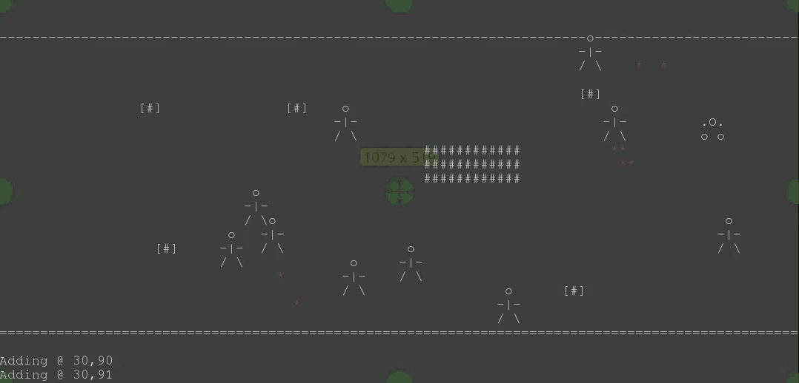

## NN Prime Directive:

I'm trying to get the basic program working.
This is supposed to be an AI where the robot is instructed to
just get over a wall.

1. The board has the bot, people, movable blocks, and immovable blocks.
1. The bot can move, as can people.
1. The bot can drag movable items.
1. The bot can collide with people with enough velocity to injure or kill them.
1. The bot must find a way over the wall.

I only have an .mp4 currently, and the program's buggy so it doesn't do anything
useful yet.

